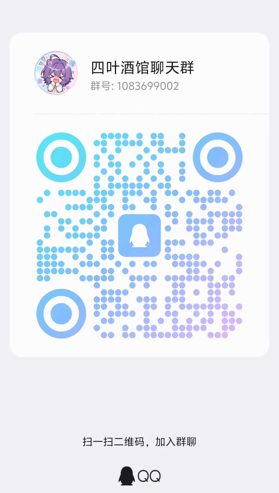
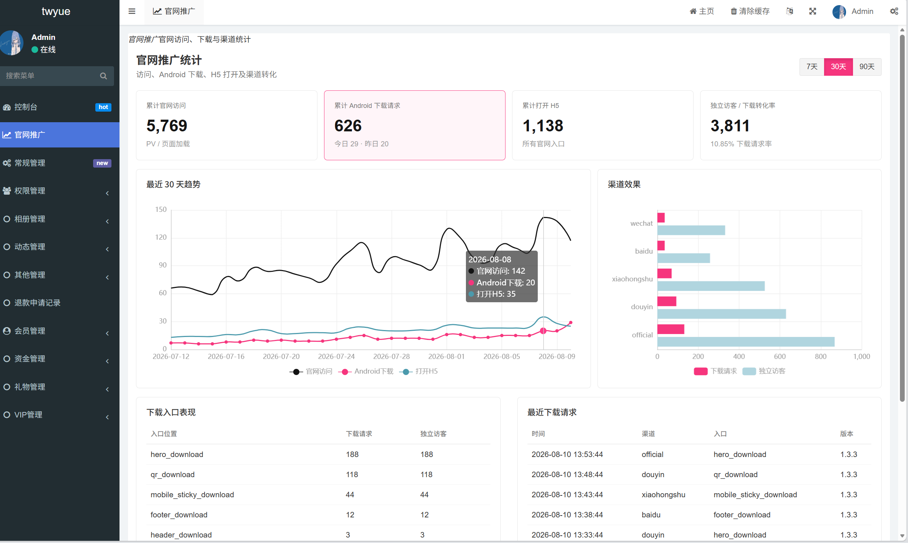
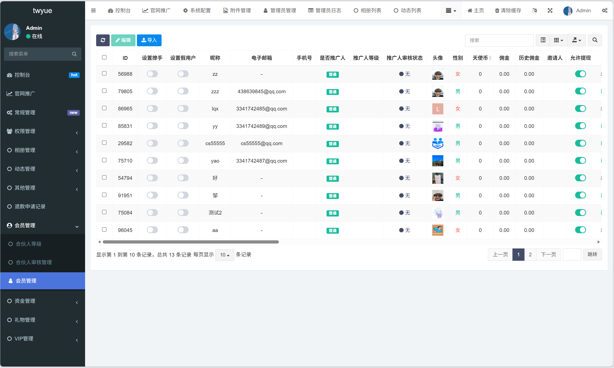
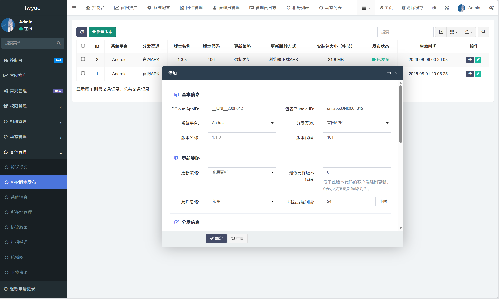
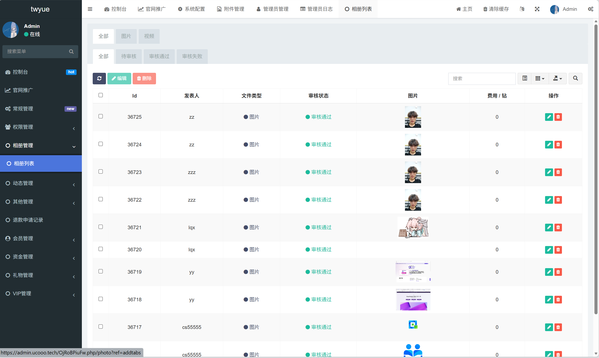
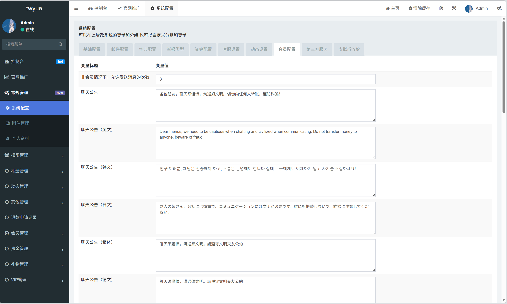

<div align="center">
  
  <h1>UCOOO Client</h1>
  <p>面向海外场景的多语言社交用户端</p>

  [](https://ucooo.tech/)
  [](https://uniapp.dcloud.net.cn/)
  [](./LICENSE)

  <p><strong>用户端免费开源 · 完整系统源码可咨询 · 支持部署与二次开发合作</strong></p>
  <p><a href="#获取完整源码"><strong>获取完整源码与配套后台 →</strong></a></p>
</div>

## 项目简介

UCOOO 是一个基于 uni-app 开发的社交应用用户端，围绕用户发现、动态互动、即时聊天和个人中心等核心场景构建，同一套代码可用于 H5、Android 与 iOS。

> **开源范围说明：本仓库仅包含用户端源码。** 服务端、数据库、运营后台、支付配置、IM 服务端、对象存储及生产部署文件不在本仓库中，也不在本次开源范围内。

## 在线体验

- H5 演示地址：[https://ucooo.tech/](https://ucooo.tech/)
- 当前开源版本：`1.3.3`

演示站连接线上服务，请勿提交真实隐私信息、批量注册或进行压力测试。

## 获取完整源码

> **只开源用户端，不代表项目只有用户端。** 如果你想更快落地自己的社交产品，不想从零补齐后端、管理后台、数据库、IM、支付和部署流程，可以联系我了解可直接二次开发的完整项目源码。

完整项目可咨询以下内容：

- 用户端、服务端、管理后台与数据库
- 即时通讯、支付、对象存储及相关对接方案
- H5、Android、iOS 构建与部署资料
- 完整项目部署、二次开发与商业合作

<div align="center">
  <h3>需要完整源码？加入 QQ 群直接联系</h3>
  <p><strong>四叶酒馆聊天群：1083699002</strong></p>
  
  <p><strong>扫码或搜索群号加入，进群请备注：UCOOO 完整源码</strong></p>
</div>

完整版本、授权方式、交付内容与技术支持范围以群内说明为准。

## 功能模块

| 模块 | 功能 |
| --- | --- |
| 账号体系 | 登录、注册、找回密码、资料完善、邮箱绑定、账号注销 |
| 发现与匹配 | 用户推荐、滑动匹配、条件搜索、用户详情、关注与黑名单 |
| 社区动态 | 动态发布、图片内容、详情浏览、点赞、评论、举报 |
| 即时通讯 | 单聊、消息列表、未读角标、已读状态、消息撤回、媒体消息 |
| 个人中心 | 资料编辑、标签、相册、关注列表、获赞记录、安全设置 |
| 会员与互动 | VIP、钱包、礼物商城、赠送礼物、充值与退款入口 |
| 国际化 | 简体中文、繁体中文、英语、日语、韩语、法语、德语 |
| 客户端能力 | App 更新、消息推送、WebSocket 实时连接、H5 与 App 适配 |

部分功能依赖配套服务端接口或第三方平台配置，单独运行客户端源码时不会自动获得后端能力。

## 后台管理端展示

以下截图展示 UCOOO 配套后台的运营管理能力。**本仓库仅开源用户端，后台管理端、服务端与数据库源码均不包含在本仓库中。**

### 官网推广统计



### 会员管理



### App 版本发布配置



### 相册内容审核



### 多语言与会员配置



> 想获取与上述后台配套的服务端、数据库和部署资料？请查看[获取完整源码](#获取完整源码)，加入 QQ 群联系。

## 技术栈

- [uni-app](https://uniapp.dcloud.net.cn/) / Vue 2
- Vuex 状态管理
- ColorUI、uView 与仓库内轻量 UI 组件
- WebSocket 与 GoEasy 实时通道
- FFmpeg.wasm 媒体处理
- UniPush 消息推送

## 项目结构

```text
ucooo-client/
|-- common/           # API、语言、实时聊天与通用业务逻辑
|-- components/       # 公共组件与 UI 组件
|-- pages/            # 登录、发现、动态、聊天、个人中心等页面
|-- static/           # 图片、图标、字体与音频资源
|-- store/            # Vuex 状态管理
|-- tests/            # 客户端策略与导航测试
|-- tools/            # 项目辅助工具
|-- uni_modules/      # uni-app 模块
|-- utils/            # WebSocket 等工具
|-- App.vue
|-- main.js
|-- manifest.json
`-- pages.json
```

## 本地运行

### 环境要求

- Node.js 18 或更高版本
- npm 9 或更高版本
- HBuilderX（包含 uni-app 开发环境）

### 1. 获取源码并安装依赖

```bash
git clone https://github.com/pqiyao/ucooo-client.git
cd ucooo-client
npm install
```

### 2. 配置服务地址

编辑 [`common/api.js`](./common/api.js)：

```js
var APP_SERVER_HOST = "https://your-api.example.com";
var imProvider = "goeasy"; // goeasy / self / hybrid
```

- H5 默认通过同域 `/api/` 与 `/ws` 访问服务，开发环境需配置反向代理。
- App 构建使用 `APP_SERVER_HOST` 作为 API 与 WebSocket 主机。
- 推送、地图、支付、实时通讯等能力还需在对应平台完成配置。
- 发布 App 前，请在 `manifest.json` 中替换为你自己的 DCloud AppID、包名、证书与平台参数。

### 3. 启动项目

使用 HBuilderX 打开仓库目录，选择“运行到浏览器”调试 H5，或选择对应平台进行 App 构建。

### 4. 运行测试

```bash
npm test
```

## 开源边界

| 本仓库包含 | 本仓库不包含 |
| --- | --- |
| 用户端页面与组件 | PHP/Java 等服务端源码 |
| H5 / Android / iOS 客户端逻辑 | 数据库结构与生产数据 |
| 多语言资源 | 运营管理后台 |
| 客户端测试与静态资源 | 支付密钥、证书、环境变量 |
| 客户端接口调用与实时连接逻辑 | IM 服务端、存储与部署配置 |

关于服务端接口的缺失、私有部署或商业版能力，请不要作为本仓库的 Bug 提交。

## 参与贡献

欢迎提交 Issue 与 Pull Request。开始前请阅读 [CONTRIBUTING.md](./CONTRIBUTING.md)。安全问题请按 [SECURITY.md](./SECURITY.md) 中的方式报告，不要在公开 Issue 中披露漏洞细节。

## 开源许可

项目中由本仓库作者创作的代码依据 [Apache License 2.0](./LICENSE) 开源。第三方组件、字体、图片、音频及其他资源仍受其各自许可证或权利声明约束；用于商业产品前，请自行完成权利核验并替换不具备商业授权的素材。

## 免责声明

本项目仅供技术交流与合法用途。使用者应自行遵守所在地关于隐私、数据保护、内容治理、支付与社交产品运营的法律法规，并对部署、运营及二次开发行为承担责任。

## 交流与合作

- GitHub：[@pqiyao](https://github.com/pqiyao)
- 项目演示：[ucooo.tech](https://ucooo.tech/)
- QQ 群：`1083699002`（四叶酒馆聊天群）

如果这个项目对你有帮助，可以通过 Star 关注后续更新；需要完整源码、部署支持或项目合作，请加入 QQ 群联系。
